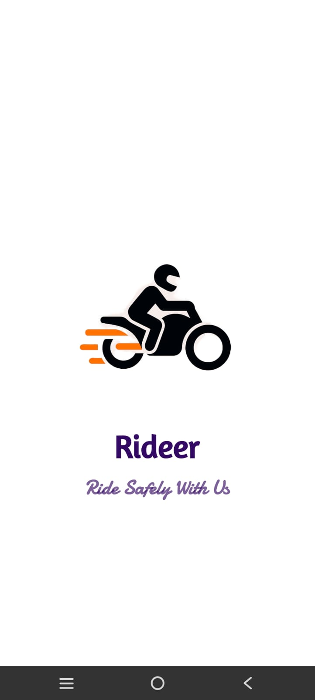
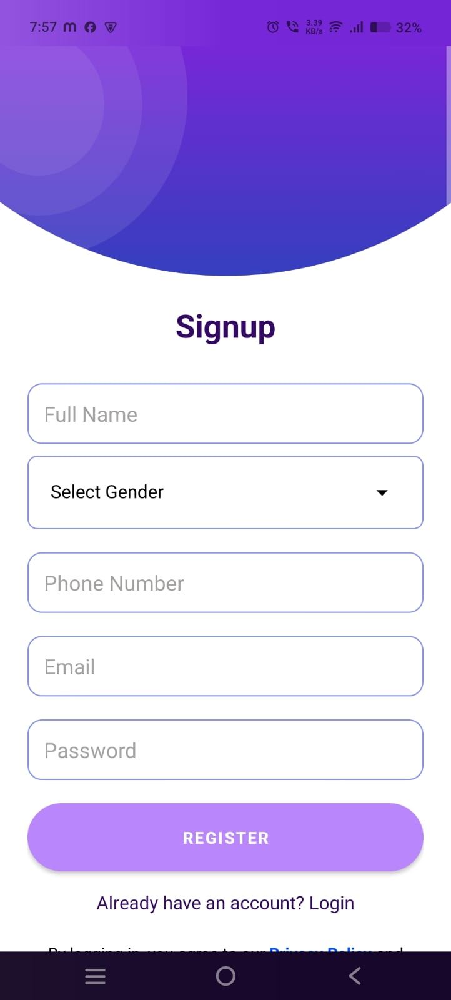
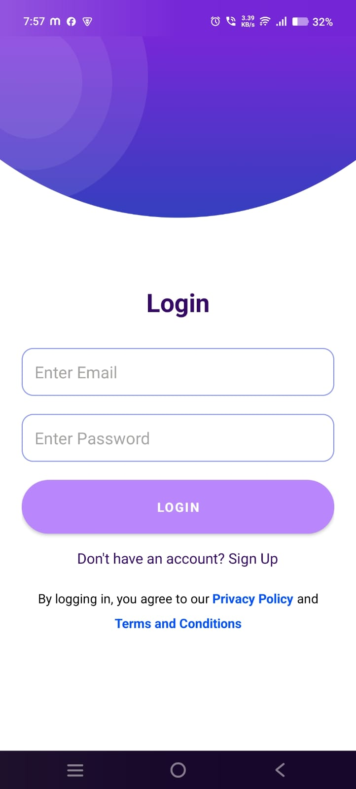
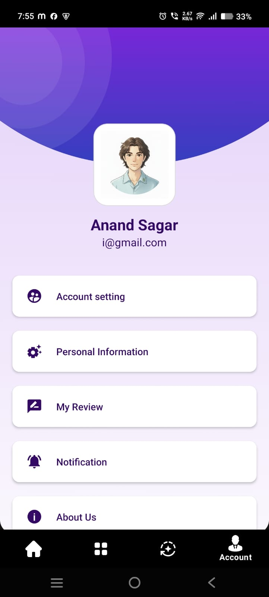
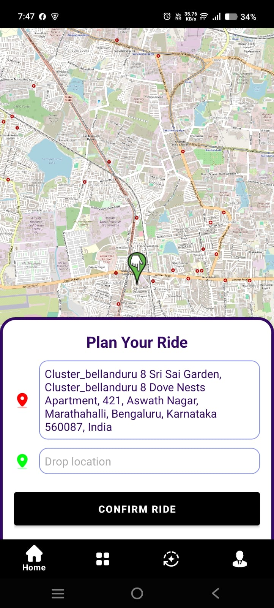
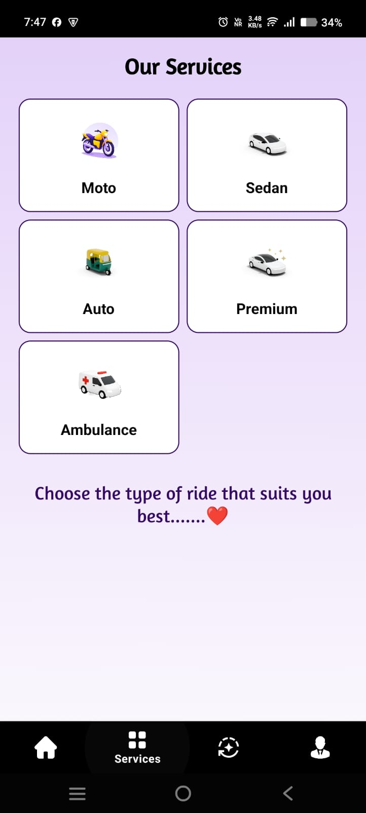
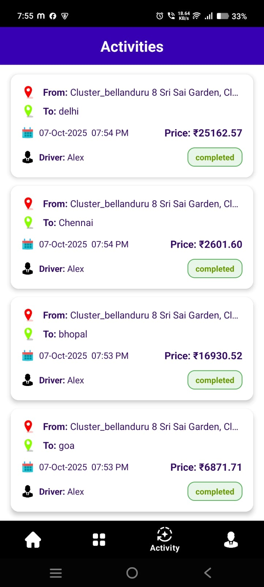
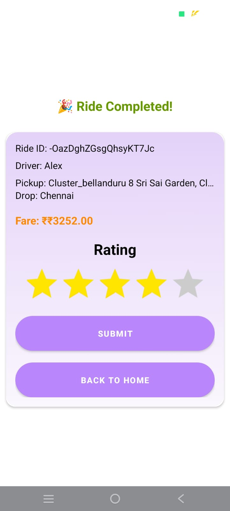
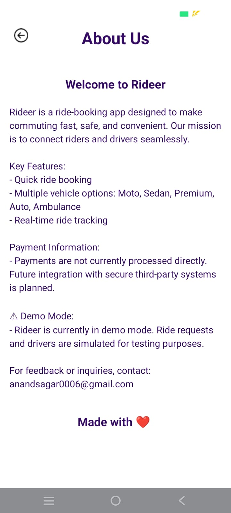

# 🚖 Rider App

A ride-booking Android application that allows users to request rides with real-time location tracking and route visualization. Built using **Java, Android Studio, Firebase, and OpenStreetMap (OSMDroid)**.

---

## 📱 Features

* Real-time location tracking for pickup and destination points
* Ride request management with dynamic updates
* Firebase integration for authentication and ride data storage
* Interactive **OpenStreetMap** integration for route display
* Intuitive UI with smooth user experience

---

## 🛠️ Tech Stack

* **Language:** Java, XML
* **Frameworks & Tools:** Android Studio, Firebase
* **Map API:** OpenStreetMap (OSMDroid)

---

## 📸 Screenshots

Here are some screenshots of the app:

| Splash                                  | Signup                           | Login                                                              |
| --------------------------------------- | -------------------------------- | ------------------------------------------------------------------ |
|  |  |  |

| Profile                                                              | Enter Drop Location                                                                    | Service                           |
| -------------------------------------------------------------------------- | -------------------------------------------------------------------------------------- | --------------------------------------- |
|  |  |  |

| Ride History                            |               Rating             |About                                                               |
| --------------------------------------- | -------------------------------- | ------------------------------------------------------------------ |
|  |  |  |

## 💡 Future Enhancements

* Implement real-time driver tracking on the OpenStreetMap view
* Add in-app chat between driver and rider
* Introduce ride fare estimation using distance and time

---

**🔗 Project Type:** Android Application
**💬 Developed by:** Anand Sagar
